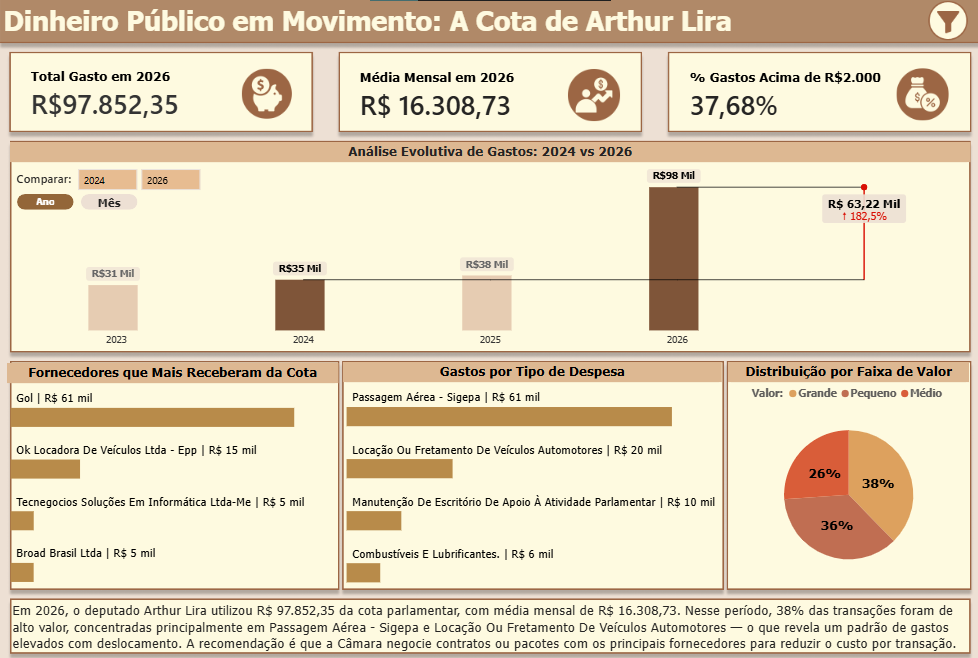

# 💸 Dinheiro Público em Movimento: A Cota de Arthur Lira

Análise completa das despesas parlamentares do deputado federal Arthur Lira (2023–2026), cobrindo todo o ciclo de vida dos dados — da coleta via API pública até a visualização e recomendação de decisão.

---

## 📌 Sobre o Projeto

A Cota para Exercício da Atividade Parlamentar (CEAP) é um benefício mensal concedido a cada deputado federal para custear despesas relacionadas ao exercício do mandato. Os valores são públicos e disponibilizados pela API aberta da Câmara dos Deputados.

Este projeto coleta, trata, enriquece e analisa os registros de pagamentos e reembolsos do deputado Arthur Lira (ID: 160541) entre 2023 e 2026, respondendo às seguintes perguntas:

- Para onde vai o dinheiro da cota parlamentar?
- Quais fornecedores mais se beneficiam desses gastos?
- O padrão de gastos muda em anos eleitorais?
- Como a Câmara poderia reduzir esses custos?

## 📊 Dashboard



🔗 **[Acesse o Dashboard no Power BI Service](https://app.powerbi.com/view?r=eyJrIjoiYzRhNzM4YzItNWE4MC00ZTQ5LWFmYTItNjQzMDU4MGI5MzJmIiwidCI6IjkwNzg5MzgzLTExYjMtNGQ0My05YjI4LWNlNDM1M2IyZDg1NSJ9)**

---

## 🔄 Ciclo de Vida dos Dados

```
Coleta (API) → Armazenamento Bruto (JSON) → Limpeza (CSV) → Enriquecimento (CSV) → Armazenamento (SQLite) → Visualização (Power BI) → Decisão (Narrativa)
```

| Etapa | O que foi feito |
|---|---|
| **Coleta** | Requisições à API pública da Câmara dos Deputados via Python |
| **Armazenamento Bruto** | Dados salvos em JSON antes de qualquer transformação |
| **Limpeza** | Remoção de colunas desnecessárias, tratamento de nulos e padronização de tipos |
| **Enriquecimento** | Criação das colunas `faixaValor`, `trimestre` e `nomeMes` |
| **Armazenamento** | Persistência final em banco de dados SQLite |
| **Visualização** | Dashboard interativo no Power BI com DAX avançado |
| **Decisão** | Narrativa dinâmica com recomendação baseada nos dados |

---

## 🛠️ Tecnologias Utilizadas

- **Python** — coleta, limpeza e enriquecimento dos dados
  - `requests` — requisições à API
  - `pandas` — transformação e tratamento
  - `sqlite3` — persistência no banco de dados
  - `python-dotenv` — gerenciamento de variáveis de ambiente
- **SQLite** — armazenamento estruturado dos dados tratados
- **Power BI** — modelagem, DAX e visualização
- **GitHub Actions** — automação mensal da coleta de dados

---

## 📁 Estrutura do Repositório

```
despesas-parlamentares-arthur-lira/
│
├── .github/
│   └── workflows/
│       └── coleta_mensal.yml         # Automação mensal via GitHub Actions
│
├── assets/
│   └── dashboard_preview.png         # Print do dashboard para o README
│
├── bi/
│   └── arthur_lira_despesas.pbix     # Arquivo Power BI
│
├── data/
│   ├── despesas.json                 # Dados brutos coletados da API
│   ├── despesas_tratadas.csv         # Dados após limpeza
│   └── despesas_enriquecidas.csv     # Dados após enriquecimento
│
├── src/
│   ├── coleta_tratamento.py          # Script principal do pipeline
│   └── analise_exploratoria.py       # Script de análise exploratória
│
├── .env                              # Variáveis de ambiente (não versionado)
├── .gitignore
├── README.md
└── requirements.txt
```

---

## ⚙️ Pipeline de Dados

O script `coleta_tratamento.py` executa as seguintes etapas em sequência:

**1. Coleta** — Requisições à API da Câmara para os anos de 2023 a 2026, com iteração por ano para contornar o limite de paginação da API.

**2. Armazenamento bruto** — Os dados são salvos em `data/despesas.json` antes de qualquer transformação, preservando o dado original.

**3. Limpeza** — Remoção de colunas sem valor analítico (`codDocumento`, `urlDocumento`, entre outras), tratamento de valores nulos e padronização de nomes de fornecedores.

**4. Enriquecimento** — Criação de colunas calculadas:
- `faixaValor` — classifica cada despesa como `pequeno` (≤ R$500), `médio` (≤ R$2.000) ou `grande` (> R$2.000)
- `trimestre` — trimestre da despesa
- `nomeMes` — nome do mês por extenso

**5. Armazenamento** — Dados finais persistidos na tabela `tb_despesas` do banco SQLite `data/camara_dados.db`.

---

## 📊 Principais Insights

- Em **2026**, o deputado registrou um crescimento expressivo de gastos em relação aos anos anteriores — padrão consistente com anos eleitorais, onde deputados tendem a aumentar sua movimentação
- **Passagem Aérea** e **Locação de Veículos** concentram a maior parte do valor gasto, mesmo representando poucos registros — gastos grandes são minoria em quantidade, mas dominam o valor total
- A locadora **OK Locadora de Veículos Ltda** aparece como fornecedora recorrente ao longo dos anos, sugerindo preferência ou contrato informal
- Em **2024** (ano eleitoral para outros cargos), houve aumento de gastos nos meses de campanha — indicando possível apoio aos aliados de partido
- **Recomendação:** a Câmara dos Deputados deveria negociar contratos ou pacotes de milhas/crédito em lote com os principais fornecedores para reduzir o custo por transação com dinheiro público

---

## 🤖 Automação Mensal

O script de coleta é executado automaticamente todo **dia 1 de cada mês** via GitHub Actions, coletando os dados do mês anterior encerrado. A automação permanece ativa até **01/01/2027**, quando coleta os dados de dezembro de 2026 e encerra o ciclo do projeto.

O workflow está em `.github/workflows/coleta_mensal.yml` e pode ser disparado manualmente pelo GitHub a qualquer momento via `workflow_dispatch`.

---

## 🚀 Como Executar Localmente

**1. Clone o repositório**
```bash
git clone https://github.com/Beattriz-Oliveira/despesas-parlamentares-arthur-lira.git
cd despesas-parlamentares-arthur-lira
```

**2. Instale as dependências**
```bash
pip install -r requirements.txt
```

**3. Execute o pipeline**
```bash
python src/coleta_tratamento.py
```

Os arquivos gerados serão salvos automaticamente na pasta `data/`.

---

## ⚠️ Limitações Conhecidas

- A API da Câmara retorna no máximo 100 registros por requisição sem paginação adicional. Os anos com exatamente 100 registros podem estar incompletos. Essa limitação está documentada e não impacta os principais insights, dado o volume restante.
- O arquivo `.db` não está versionado no repositório por boas práticas — ele é gerado localmente ao executar o script.

---

## 👩‍💻 Autora

**Beattriz Oliveira**  
Analista de BI | Arquitetura de Dados  
[GitHub](https://github.com/Beattriz-Oliveira)